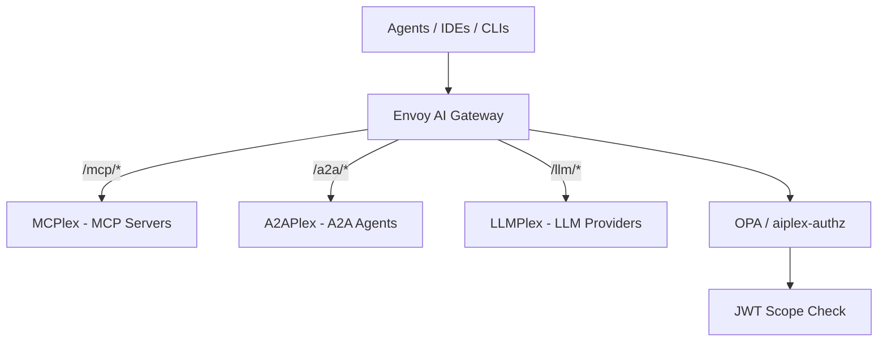
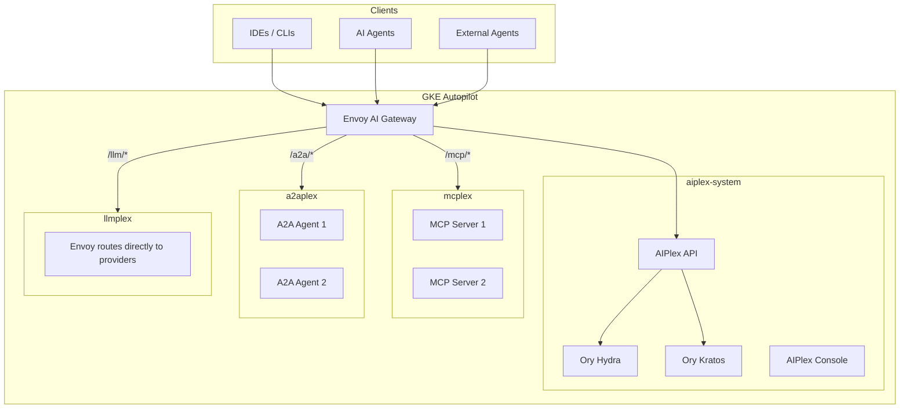
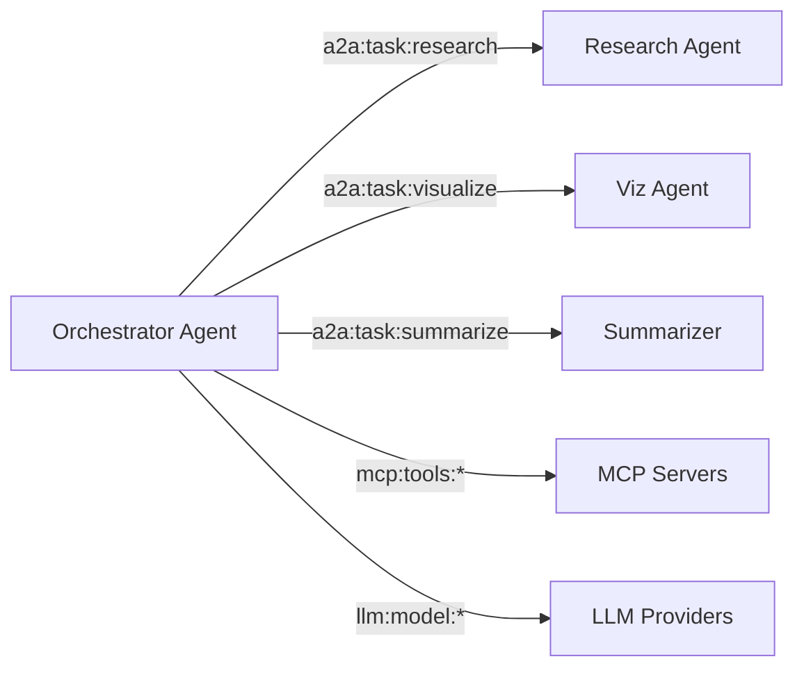
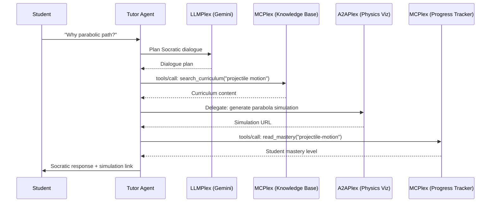

# AIPlex Documentation Site & README Implementation Plan

> **For agentic workers:** REQUIRED SUB-SKILL: Use superpowers:subagent-driven-development (recommended) or superpowers:executing-plans to implement this plan task-by-task. Steps use checkbox (`- [ ]`) syntax for tracking.

**Goal:** Create a Docusaurus docs site at `/docs-site/` and a repo-root `README.md` that auto-generates reference docs from source and provides curated DX guides for three audiences (admins, developers, operators).

**Architecture:** Docusaurus 3.x project with Go-based doc generators that parse cobra commands and chi routes into markdown. A shell script orchestrates generation, and `npm run build` calls it before Docusaurus builds. Curated guides are hand-written markdown referencing the auto-generated references.

**Tech Stack:** Docusaurus 3.x, TypeScript, React, MDX, Mermaid, Go (generators), Shell scripts

---

### Task 1: Scaffold Docusaurus Project

**Files:**
- Create: `docs-site/package.json`
- Create: `docs-site/docusaurus.config.ts`
- Create: `docs-site/sidebars.ts`
- Create: `docs-site/tsconfig.json`
- Create: `docs-site/.gitignore`
- Create: `docs-site/babel.config.js`

- [ ] **Step 1: Initialize Docusaurus**

```bash
cd /home/user/aiplex
npx create-docusaurus@latest docs-site classic --typescript
```

- [ ] **Step 2: Remove default boilerplate**

Delete the auto-generated `docs-site/docs/`, `docs-site/blog/`, and `docs-site/src/pages/index.tsx` (we'll replace them). Keep `docs-site/src/css/custom.css`.

```bash
rm -rf docs-site/docs docs-site/blog docs-site/src/pages/index.tsx docs-site/src/pages/index.module.css
```

- [ ] **Step 3: Install Mermaid plugin**

```bash
cd /home/user/aiplex/docs-site && npm install @docusaurus/theme-mermaid
```

- [ ] **Step 4: Configure docusaurus.config.ts**

Replace `docs-site/docusaurus.config.ts` with:

```typescript
import {themes as prismThemes} from 'prism-react-renderer';
import type {Config} from '@docusaurus/types';
import type * as Preset from '@docusaurus/preset-classic';

const config: Config = {
  title: 'AIPlex',
  tagline: 'One control plane for every AI interaction',
  favicon: 'img/favicon.ico',
  url: 'https://vamsiramakrishnan.github.io',
  baseUrl: '/aiplex/',
  organizationName: 'vamsiramakrishnan',
  projectName: 'aiplex',
  trailingSlash: false,
  onBrokenLinks: 'throw',
  onBrokenMarkdownLinks: 'warn',
  markdown: {
    mermaid: true,
  },
  themes: ['@docusaurus/theme-mermaid'],
  i18n: {
    defaultLocale: 'en',
    locales: ['en'],
  },
  presets: [
    [
      'classic',
      {
        docs: {
          sidebarPath: './sidebars.ts',
          editUrl: 'https://github.com/vamsiramakrishnan/aiplex/tree/main/docs-site/',
        },
        blog: false,
        theme: {
          customCss: './src/css/custom.css',
        },
      } satisfies Preset.Options,
    ],
  ],
  themeConfig: {
    navbar: {
      title: 'AIPlex',
      items: [
        {type: 'docSidebar', sidebarId: 'docs', position: 'left', label: 'Docs'},
        {href: 'https://github.com/vamsiramakrishnan/aiplex', label: 'GitHub', position: 'right'},
      ],
    },
    footer: {
      style: 'dark',
      links: [
        {
          title: 'Docs',
          items: [
            {label: 'Getting Started', to: '/docs/getting-started/overview'},
            {label: 'Guides', to: '/docs/guides/deploy-mcp-server'},
            {label: 'Concepts', to: '/docs/concepts/architecture'},
          ],
        },
        {
          title: 'Reference',
          items: [
            {label: 'CLI', to: '/docs/reference/cli'},
            {label: 'API', to: '/docs/reference/api'},
            {label: 'Configuration', to: '/docs/reference/config'},
          ],
        },
        {
          title: 'More',
          items: [
            {label: 'GitHub', href: 'https://github.com/vamsiramakrishnan/aiplex'},
          ],
        },
      ],
      copyright: `Copyright © ${new Date().getFullYear()} AIPlex. Apache 2.0 License.`,
    },
    prism: {
      theme: prismThemes.github,
      darkTheme: prismThemes.dracula,
      additionalLanguages: ['bash', 'yaml', 'json', 'go', 'rego'],
    },
    mermaid: {
      theme: {light: 'neutral', dark: 'dark'},
    },
  } satisfies Preset.ThemeConfig,
};

export default config;
```

- [ ] **Step 5: Configure sidebars.ts**

```typescript
import type {SidebarsConfig} from '@docusaurus/plugin-content-docs';

const sidebars: SidebarsConfig = {
  docs: [
    {
      type: 'category',
      label: 'Getting Started',
      collapsed: false,
      items: [
        'getting-started/overview',
        'getting-started/quickstart-admin',
        'getting-started/quickstart-developer',
        'getting-started/quickstart-operator',
      ],
    },
    {
      type: 'category',
      label: 'Guides',
      items: [
        'guides/deploy-mcp-server',
        'guides/deploy-a2a-agent',
        'guides/configure-llm-routing',
        'guides/register-agent',
        'guides/manage-permissions',
        'guides/oauth-flows',
        'guides/cross-plane-access',
        'guides/declarative-apply',
      ],
    },
    {
      type: 'category',
      label: 'Concepts',
      items: [
        'concepts/architecture',
        'concepts/three-planes',
        'concepts/auth-model',
        'concepts/scopes',
        'concepts/identity',
        'concepts/policy',
      ],
    },
    {
      type: 'category',
      label: 'Reference',
      items: [
        {
          type: 'category',
          label: 'CLI',
          items: [{type: 'autogenerated', dirName: 'reference/cli'}],
        },
        {
          type: 'category',
          label: 'API',
          items: [{type: 'autogenerated', dirName: 'reference/api'}],
        },
        {
          type: 'category',
          label: 'Configuration',
          items: [{type: 'autogenerated', dirName: 'reference/config'}],
        },
        'reference/scopes-table',
      ],
    },
    {
      type: 'category',
      label: 'Examples',
      items: [
        'examples/quickstart-yaml',
        'examples/multi-agent',
        'examples/ember-case-study',
      ],
    },
  ],
};

export default sidebars;
```

- [ ] **Step 6: Add generate script to package.json**

Add to `docs-site/package.json` scripts:

```json
{
  "scripts": {
    "generate": "bash scripts/generate-docs.sh",
    "prebuild": "bash scripts/generate-docs.sh",
    "prestart": "bash scripts/generate-docs.sh"
  }
}
```

(Merge these into the existing scripts block that Docusaurus scaffolds.)

- [ ] **Step 7: Create .gitignore additions**

Add to `docs-site/.gitignore`:

```
docs/reference/cli/_generated/
docs/reference/api/_generated/
docs/reference/config/_generated/
```

- [ ] **Step 8: Verify build works**

```bash
cd /home/user/aiplex/docs-site && npm run build
```

Expected: Build succeeds (with warnings about missing docs — that's fine, we add them next).

- [ ] **Step 9: Commit**

```bash
cd /home/user/aiplex
git add docs-site/
git commit -m "feat: scaffold Docusaurus docs site with config and sidebars"
```

---

### Task 2: Create Landing Page

**Files:**
- Create: `docs-site/src/pages/index.tsx`
- Create: `docs-site/src/pages/index.module.css`

- [ ] **Step 1: Create landing page component**

Create `docs-site/src/pages/index.tsx`:

```tsx
import React from 'react';
import clsx from 'clsx';
import Link from '@docusaurus/Link';
import useDocusaurusContext from '@docusaurus/useDocusaurusContext';
import Layout from '@theme/Layout';
import styles from './index.module.css';

function HeroBanner() {
  const {siteConfig} = useDocusaurusContext();
  return (
    <header className={clsx('hero hero--primary', styles.heroBanner)}>
      <div className="container">
        <h1 className="hero__title">{siteConfig.title}</h1>
        <p className="hero__subtitle">{siteConfig.tagline}</p>
        <p className={styles.heroDescription}>
          Govern agent-to-tool, agent-to-agent, and agent-to-model interactions
          through a single gateway, auth stack, and policy engine.
        </p>
        <div className={styles.buttons}>
          <Link className="button button--secondary button--lg" to="/docs/getting-started/overview">
            Get Started
          </Link>
        </div>
      </div>
    </header>
  );
}

const planes = [
  {
    title: 'MCPlex',
    subtitle: 'Agent ↔ Tool',
    description: 'Deploy and govern MCP servers. Manage tool-level permissions with OAuth scopes.',
    link: '/docs/guides/deploy-mcp-server',
  },
  {
    title: 'A2APlex',
    subtitle: 'Agent ↔ Agent',
    description: 'Enable agent delegation with identity, consent, and audit trails.',
    link: '/docs/guides/deploy-a2a-agent',
  },
  {
    title: 'LLMPlex',
    subtitle: 'Agent ↔ Model',
    description: 'Route to LLM providers with failover, cost budgets, and per-model permissions.',
    link: '/docs/guides/configure-llm-routing',
  },
];

const roles = [
  {
    title: 'Platform Admin',
    description: 'Set up AIPlex on GKE, configure auth, and manage infrastructure.',
    link: '/docs/getting-started/quickstart-admin',
    label: 'Admin Quickstart',
  },
  {
    title: 'Agent Developer',
    description: 'Register agents, request scopes, and integrate via OAuth flows.',
    link: '/docs/getting-started/quickstart-developer',
    label: 'Developer Quickstart',
  },
  {
    title: 'Operator',
    description: 'Deploy MCP servers, A2A agents, and LLM routes via CLI or Console.',
    link: '/docs/getting-started/quickstart-operator',
    label: 'Operator Quickstart',
  },
];

export default function Home(): React.JSX.Element {
  const {siteConfig} = useDocusaurusContext();
  return (
    <Layout title={siteConfig.title} description={siteConfig.tagline}>
      <HeroBanner />
      <main>
        <section className={styles.planes}>
          <div className="container">
            <h2 className={styles.sectionTitle}>Three Planes, One Control Plane</h2>
            <div className={styles.grid}>
              {planes.map((plane) => (
                <div key={plane.title} className={styles.card}>
                  <h3>{plane.title}</h3>
                  <p className={styles.cardSubtitle}>{plane.subtitle}</p>
                  <p>{plane.description}</p>
                  <Link to={plane.link}>Learn more →</Link>
                </div>
              ))}
            </div>
          </div>
        </section>
        <section className={styles.roles}>
          <div className="container">
            <h2 className={styles.sectionTitle}>Start Here</h2>
            <div className={styles.grid}>
              {roles.map((role) => (
                <div key={role.title} className={styles.card}>
                  <h3>{role.title}</h3>
                  <p>{role.description}</p>
                  <Link className="button button--primary button--sm" to={role.link}>
                    {role.label}
                  </Link>
                </div>
              ))}
            </div>
          </div>
        </section>
      </main>
    </Layout>
  );
}
```

- [ ] **Step 2: Create landing page styles**

Create `docs-site/src/pages/index.module.css`:

```css
.heroBanner {
  padding: 4rem 0;
  text-align: center;
  position: relative;
  overflow: hidden;
}

.heroDescription {
  font-size: 1.2rem;
  max-width: 600px;
  margin: 0 auto 2rem;
  opacity: 0.9;
}

.buttons {
  display: flex;
  align-items: center;
  justify-content: center;
  gap: 1rem;
}

.sectionTitle {
  text-align: center;
  margin-bottom: 2rem;
  font-size: 1.8rem;
}

.planes,
.roles {
  padding: 3rem 0;
}

.roles {
  background: var(--ifm-color-emphasis-100);
}

.grid {
  display: grid;
  grid-template-columns: repeat(auto-fit, minmax(280px, 1fr));
  gap: 1.5rem;
}

.card {
  background: var(--ifm-card-background-color);
  border: 1px solid var(--ifm-color-emphasis-200);
  border-radius: 8px;
  padding: 1.5rem;
}

.card h3 {
  margin-bottom: 0.25rem;
}

.cardSubtitle {
  color: var(--ifm-color-emphasis-600);
  font-size: 0.9rem;
  margin-bottom: 0.75rem;
}
```

- [ ] **Step 3: Verify landing page renders**

```bash
cd /home/user/aiplex/docs-site && npx docusaurus start --port 3333 &
sleep 5 && curl -s http://localhost:3333/ | head -20
kill %1
```

Expected: HTML output containing "AIPlex" and "One control plane".

- [ ] **Step 4: Commit**

```bash
cd /home/user/aiplex
git add docs-site/src/pages/
git commit -m "feat: add docs site landing page with plane cards and role funnels"
```

---

### Task 3: Create PlaneBadge MDX Component

**Files:**
- Create: `docs-site/src/components/PlaneBadge.tsx`

- [ ] **Step 1: Create the PlaneBadge component**

Create `docs-site/src/components/PlaneBadge.tsx`:

```tsx
import React from 'react';

const planeColors: Record<string, {bg: string; text: string}> = {
  mcplex: {bg: '#e3f2fd', text: '#1565c0'},
  a2aplex: {bg: '#f3e5f5', text: '#7b1fa2'},
  llmplex: {bg: '#e8f5e9', text: '#2e7d32'},
};

interface PlaneBadgeProps {
  plane: 'mcplex' | 'a2aplex' | 'llmplex';
}

export default function PlaneBadge({plane}: PlaneBadgeProps): React.JSX.Element {
  const colors = planeColors[plane] || {bg: '#f5f5f5', text: '#333'};
  const labels: Record<string, string> = {
    mcplex: 'MCPlex',
    a2aplex: 'A2APlex',
    llmplex: 'LLMPlex',
  };
  return (
    <span
      style={{
        backgroundColor: colors.bg,
        color: colors.text,
        padding: '2px 8px',
        borderRadius: '4px',
        fontSize: '0.8rem',
        fontWeight: 600,
        marginRight: '4px',
      }}>
      {labels[plane] || plane}
    </span>
  );
}
```

- [ ] **Step 2: Commit**

```bash
cd /home/user/aiplex
git add docs-site/src/components/
git commit -m "feat: add PlaneBadge MDX component for tagging guides by plane"
```

---

### Task 4: Write Getting Started Docs (Curated)

**Files:**
- Create: `docs-site/docs/getting-started/overview.md`
- Create: `docs-site/docs/getting-started/quickstart-admin.md`
- Create: `docs-site/docs/getting-started/quickstart-developer.md`
- Create: `docs-site/docs/getting-started/quickstart-operator.md`

- [ ] **Step 1: Create overview.md**

Create `docs-site/docs/getting-started/overview.md`:

```markdown
---
sidebar_position: 1
title: Overview
---

# What is AIPlex?

AIPlex is a unified control plane for AI agent interactions. It governs three planes through a single gateway, auth stack, policy engine, and audit trail.

| Plane | Protocol | What It Governs |
| --- | --- | --- |
| **MCPlex** | MCP (JSON-RPC) | Agent ↔ Tool |
| **A2APlex** | A2A (HTTP/JSON) | Agent ↔ Agent |
| **LLMPlex** | Provider APIs | Agent ↔ Model |

## How It Works



Every request passes through a single gateway with:

- **OAuth 2.1 auth** via Ory Hydra + Kratos — agents get JWTs with scoped permissions
- **Unified policy** — a 20-line OPA/Rego policy checks JWT scopes across all planes
- **SPIFFE identity** — every workload gets a cryptographic identity via Cloud Service Mesh
- **Full audit trail** — who called what, when, with which permissions

## Key Concepts

- **Scopes** define permissions: `mcp:tools:search`, `a2a:task:research`, `llm:model:gemini-2.5-flash`
- **Three permission dimensions**: agent ceiling (A) ∩ user ceiling (B) ∩ user consent (C)
- **One token** carries permissions across all three planes

## Next Steps

Pick the quickstart that matches your role:

- **[Platform Admin →](./quickstart-admin)** — Set up AIPlex on GKE
- **[Agent Developer →](./quickstart-developer)** — Register an agent and get tokens
- **[Operator →](./quickstart-operator)** — Deploy tools, agents, and models
```

- [ ] **Step 2: Create quickstart-admin.md**

Create `docs-site/docs/getting-started/quickstart-admin.md`:

```markdown
---
sidebar_position: 2
title: "Quickstart: Platform Admin"
---

# Platform Admin Quickstart

Set up AIPlex on a GCP project with GKE Autopilot, Ory Hydra/Kratos, and Envoy AI Gateway.

## Prerequisites

- GCP project with billing enabled
- `gcloud` CLI authenticated
- `terraform` >= 1.5
- `helm` >= 3.12
- `kubectl` configured

## 1. Initialize

```bash
aiplex init
```

The interactive wizard detects your GCP project, checks prerequisites, and generates `deploy/terraform/terraform.tfvars`.

## 2. Bootstrap the Platform

```bash
aiplex platform apply
```

This runs Terraform to create GKE Autopilot, AlloyDB, Firestore, and then deploys the Helm chart with Ory Hydra, Kratos, OPA, and the AIPlex API.

## 3. Verify

```bash
aiplex doctor
```

Doctor checks CLI config, GCP connectivity, Kubernetes cluster, certificates, DNS, and pod health. All checks should pass.

## 4. Check Health

```bash
aiplex health
```

Confirms the API, auth, and gateway endpoints are reachable.

## What's Next

- [Architecture concepts](../concepts/architecture) — understand the system design
- [Auth model](../concepts/auth-model) — how Ory Hydra + Kratos handle OAuth 2.1
- [Identity & zero trust](../concepts/identity) — SPIFFE, mTLS, WIF
```

- [ ] **Step 3: Create quickstart-developer.md**

Create `docs-site/docs/getting-started/quickstart-developer.md`:

```markdown
---
sidebar_position: 3
title: "Quickstart: Agent Developer"
---

# Agent Developer Quickstart

Register an agent, request scopes, and authenticate to call tools, agents, and models.

## Prerequisites

- AIPlex instance running (see [Admin Quickstart](./quickstart-admin))
- `aiplex` CLI installed and configured

## 1. Log In

```bash
aiplex login
```

Uses the OAuth device flow — you'll get a URL to open in your browser.

## 2. Register Your Agent

```bash
aiplex agents register \
  --client-id my-agent \
  --name "My Agent" \
  --description "Demo agent for testing" \
  --auth-method client_credentials \
  --scopes "mcp:tools:search_curriculum,llm:model:gemini-2.5-flash"
```

This creates an OAuth client in Ory Hydra with the requested scopes as the agent's permission ceiling (Dimension A).

## 3. Get a Token

Your agent authenticates using client credentials:

```bash
curl -X POST https://your-aiplex.example.com/oauth2/token \
  -d grant_type=client_credentials \
  -d client_id=my-agent \
  -d client_secret=<secret> \
  -d scope="mcp:tools:search_curriculum llm:model:gemini-2.5-flash"
```

The returned JWT carries only the scopes that are the intersection of agent ceiling (A) ∩ user ceiling (B) ∩ consent (C).

## 4. Call a Tool

```bash
curl -X POST https://your-aiplex.example.com/mcp/knowledge-base-xyz/mcp \
  -H "Authorization: Bearer <token>" \
  -H "Content-Type: application/json" \
  -d '{"jsonrpc":"2.0","method":"tools/call","params":{"name":"search_curriculum","arguments":{"query":"physics"}}}'
```

## What's Next

- [OAuth flows](../guides/oauth-flows) — PKCE, device grant, client credentials
- [Scopes reference](../reference/scopes-table) — all scope patterns
- [Cross-plane access](../guides/cross-plane-access) — one agent, three planes
```

- [ ] **Step 4: Create quickstart-operator.md**

Create `docs-site/docs/getting-started/quickstart-operator.md`:

```markdown
---
sidebar_position: 4
title: "Quickstart: Operator"
---

# Operator Quickstart

Deploy MCP servers, A2A agents, and LLM routes using the CLI or declarative YAML.

## Prerequisites

- AIPlex instance running (see [Admin Quickstart](./quickstart-admin))
- `aiplex` CLI configured (`aiplex login`)

## Option A: Deploy from Catalog

Browse available templates:

```bash
aiplex catalog list
```

Deploy a single MCP server:

```bash
aiplex deploy --template kb-search-server --name knowledge-base --plane mcplex
```

Check status:

```bash
aiplex status
```

## Option B: Declarative YAML

Create a manifest file `my-setup.yaml`:

```yaml
version: v1
instances:
  - name: Knowledge Base
    plane: mcplex
    template: kb-search-server
    config:
      corpus: default

agents:
  - client_id: tutor-agent
    display_name: Tutor Agent
    auth_method: client_credentials
    grant_types: [client_credentials]
    allowed_scopes:
      - mcp:tools:search_curriculum
      - llm:model:gemini-2.5-flash

routes:
  - model_id: gemini-2.5-flash
    backends:
      - provider: google
        model_id: gemini-2.5-flash
        weight: 100
        enabled: true
    budget:
      max_daily_cost_usd: 10.00
```

Apply it:

```bash
aiplex apply -f my-setup.yaml
```

## Verify

```bash
aiplex list instances
aiplex list agents
aiplex llm routes
```

## What's Next

- [Deploy MCP server guide](../guides/deploy-mcp-server) — detailed walkthrough
- [Declarative apply guide](../guides/declarative-apply) — manifest format reference
- [Manage permissions](../guides/manage-permissions) — set user and agent scopes
```

- [ ] **Step 5: Commit**

```bash
cd /home/user/aiplex
git add docs-site/docs/getting-started/
git commit -m "feat: add getting-started docs — overview and 3 role-based quickstarts"
```

---

### Task 5: Write Concept Docs (Curated)

**Files:**
- Create: `docs-site/docs/concepts/architecture.md`
- Create: `docs-site/docs/concepts/three-planes.md`
- Create: `docs-site/docs/concepts/auth-model.md`
- Create: `docs-site/docs/concepts/scopes.md`
- Create: `docs-site/docs/concepts/identity.md`
- Create: `docs-site/docs/concepts/policy.md`

- [ ] **Step 1: Create architecture.md**

Create `docs-site/docs/concepts/architecture.md`:

```markdown
---
sidebar_position: 1
title: Architecture
---

# Architecture

AIPlex sits between AI agents and the resources they use — tools, other agents, and LLM models. A single Envoy AI Gateway handles all three interaction types.



## Key Components

| Component | Role | Technology |
| --- | --- | --- |
| Envoy AI Gateway | Single entry point, routing, rate limiting, auth check | Envoy + Gateway API CRDs |
| AIPlex API | Deploy engine, catalog, consent handler, scope management | Go / chi |
| Ory Hydra | OAuth 2.1 / OIDC token issuance | Go (30MB image, 50MB RAM) |
| Ory Kratos | Identity management, login, OIDC brokering | Go (30MB image, 50MB RAM) |
| OPA / aiplex-authz | JWT scope check (ext_authz) | Rego / Rust |
| Cloud Service Mesh | mTLS between all services | SPIFFE / Istio |
| AIPlex Console | Web UI for all operations | React SPA |

## Request Flow

1. Agent sends request to gateway (e.g., `POST /mcp/server-xyz/mcp`)
2. Gateway calls ext_authz (OPA/aiplex-authz) with the JWT
3. Policy checks: is `mcp:tools:{tool_name}` in the token's scopes?
4. If allowed, gateway routes to the target workload via mTLS
5. Response flows back through the gateway with full audit logging

## Namespace Isolation

Each plane runs in its own Kubernetes namespace with network policies restricting ingress to the gateway only. A compromised MCP server cannot reach A2A agents or LLM routes.
```

- [ ] **Step 2: Create three-planes.md**

Create `docs-site/docs/concepts/three-planes.md`:

```markdown
---
sidebar_position: 2
title: The Three Planes
---

# The Three Planes

AIPlex governs three types of AI agent interactions. Each plane has its own namespace, route type, and scope prefix, but shares a single gateway, auth stack, and policy engine.

## MCPlex — Agent ↔ Tool

**Protocol:** MCP (Model Context Protocol) over JSON-RPC
**Route CRD:** `MCPRoute`
**Scope prefix:** `mcp:tools:{tool_name}`, `mcp:server:{server_id}`

MCP servers expose tools (functions) that agents can call. AIPlex deploys each server as a Kubernetes workload with its own SPIFFE identity, discovers its tools via `tools/list`, and registers each tool as an OAuth scope.

**Example:** A knowledge base server exposes `search_curriculum` and `get_document` tools.

## A2APlex — Agent ↔ Agent

**Protocol:** A2A (Agent-to-Agent) over HTTP/JSON
**Route CRD:** `HTTPRoute`
**Scope prefix:** `a2a:task:{task_type}`, `a2a:agent:{agent_id}`

A2A agents can delegate tasks to other agents. AIPlex manages which agents can call which, with full delegation chain tracking and consent.

**Example:** A tutor agent delegates a `research` task to a research agent.

## LLMPlex — Agent ↔ Model

**Protocol:** Provider APIs (OpenAI-compatible)
**Route CRD:** `LLMRoute` + `AIServiceBackend`
**Scope prefix:** `llm:model:{model_id}`, `llm:capability:{cap}`

Envoy AI Gateway routes model inference requests directly to providers with failover, load balancing, and cost budgets. No custom pods needed.

**Example:** Route 80% of traffic to Gemini, 20% to Claude, with GPT as fallback.

## Unified by Design

All three planes share:

- **One OAuth server** (Ory Hydra) — a single JWT carries scopes across all planes
- **One policy engine** (OPA) — the same 20-line Rego policy covers all planes
- **One gateway** (Envoy AI Gateway) — adding a plane means adding a route CRD
- **One audit trail** — tool calls, delegations, and model requests in one place
```

- [ ] **Step 3: Create auth-model.md**

Create `docs-site/docs/concepts/auth-model.md`:

```markdown
---
sidebar_position: 3
title: Auth Model
---

# Auth Model

AIPlex uses Ory Hydra (OAuth 2.1 / OIDC) for token issuance and Ory Kratos for identity management. Permission is the intersection of three dimensions.

## Three Dimensions

| Dimension | What | Who Configures | Stored In |
| --- | --- | --- | --- |
| **A: Agent ceiling** | Max scopes an agent can ever use | Admin | Hydra client allowed_scopes |
| **B: User ceiling** | Max scopes a user can access | Admin | AIPlex API (Firestore) |
| **C: Delegation** | What user consented to for this agent | User at runtime | Hydra consent + token |

**Effective permission = A ∩ B ∩ C**

The AIPlex API computes this intersection during Hydra's consent webhook. The JWT carries only the intersection — OPA never needs to query external data.

## Token Format

Tokens use the RFC 8693 actor claim to track both the user and the acting agent:

```json
{
  "sub": "student@school.edu",
  "azp": "tutor-agent",
  "act": { "sub": "spiffe://.../sa/tutor-agent" },
  "scope": "mcp:tools:search_curriculum a2a:task:research llm:model:gemini-2.5-flash"
}
```

- `sub` = the user
- `act.sub` = the agent (SPIFFE identity)
- `scope` = intersection of A ∩ B ∩ C

## OAuth Flows

| Agent Type | AuthN Method | Grant Type |
| --- | --- | --- |
| Internal (same GKE) | SPIFFE (mTLS) | Client Credentials |
| External (AWS/Azure) | WIF | Client Credentials |
| IDE (Cursor/Copilot) | User login via Kratos | Authorization Code + PKCE |
| CLI (Claude Code) | User approval | Device Grant (RFC 8628) |

## Why Ory, Not Keycloak?

Go-native (30MB vs 500MB images), 50MB vs 1.5GB RAM, sub-second startup. Hydra's consent webhook means AIPlex owns the consent UX entirely. Token hook for custom claims — no Java SPI.
```

- [ ] **Step 4: Create scopes.md**

Create `docs-site/docs/concepts/scopes.md`:

```markdown
---
sidebar_position: 4
title: Scopes
---

# Unified Scope Namespace

AIPlex uses a single scope namespace across all three planes. Scopes are OAuth 2.0 scopes stored in Ory Hydra and carried in JWTs.

## Scope Patterns

| Pattern | Plane | Meaning |
| --- | --- | --- |
| `mcp:tools:{tool_name}` | MCPlex | Access to a specific tool |
| `mcp:server:{server_id}` | MCPlex | Access to all tools on a server |
| `a2a:task:{task_type}` | A2APlex | Permission to delegate a task type |
| `a2a:agent:{agent_id}` | A2APlex | Permission to call a specific agent |
| `llm:model:{model_id}` | LLMPlex | Access to a specific model |
| `llm:capability:{cap}` | LLMPlex | Access to a capability (vision, code-exec) |

## How Scopes Are Created

When you deploy an MCP server, AIPlex calls `tools/list` to discover its tools and registers each as a scope in Hydra:

```
MCP server exposes: search_curriculum, get_document
→ Scopes created: mcp:tools:search_curriculum, mcp:tools:get_document
```

For A2A agents, `tasks/list` discovers task types. For LLM routes, the model ID becomes the scope.

## How Scopes Are Checked

The OPA policy (or aiplex-authz Rust service) parses the JWT and checks if the requested action's scope is in the token's claims. No external data queries.

```rego
allow if {
    body.method == "tools/call"
    sprintf("mcp:tools:%s", [body.params.name]) in scopes
}
```
```

- [ ] **Step 5: Create identity.md**

Create `docs-site/docs/concepts/identity.md`:

```markdown
---
sidebar_position: 5
title: Identity & Zero Trust
---

# Identity & Zero Trust

Every workload in AIPlex gets a cryptographic identity via SPIFFE. All service-to-service communication uses mTLS.

## SPIFFE Identities

Each deployed MCP server, A2A agent, and system component gets a SPIFFE ID:

```
Trust domain: aiplex-prod.global.PROJECT_NUMBER.workload.id.goog

aiplex-system:
  .../ns/aiplex-system/sa/aiplex-api
  .../ns/aiplex-system/sa/envoy-ai-gateway

mcplex:
  .../ns/mcplex/sa/knowledge-base-xyz

a2aplex:
  .../ns/a2aplex/sa/research-agent
```

## mTLS Enforcement

Cloud Service Mesh enforces strict mTLS. `AuthorizationPolicy` restricts each namespace to accept traffic only from the Envoy AI Gateway.

## External Agents

Agents running outside GKE (AWS, Azure, on-prem) authenticate via Workload Identity Federation (WIF). They present a platform-specific credential that gets exchanged for a GCP federated token.

## Token Hook: Actor Claim

Hydra calls a token hook on the AIPlex API before issuing each token. The hook injects the agent's SPIFFE ID as an RFC 8693 actor claim (`act.sub`). This links every token to both a user identity and an agent identity.
```

- [ ] **Step 6: Create policy.md**

Create `docs-site/docs/concepts/policy.md`:

```markdown
---
sidebar_position: 6
title: Policy Engine
---

# Policy Engine

AIPlex uses a minimal OPA policy (or the aiplex-authz Rust service) for runtime authorization. The policy is stateless — the JWT is the policy.

## The 20-Line Policy

```rego
package aiplex.authz
import rego.v1

default allow := false

token := io.jwt.decode_verify(
    input.attributes.request.http.headers.authorization,
    {"iss": "https://aiplex.example.com/auth/realms/aiplex"}
)
claims := token[2]
scopes := split(claims.scope, " ")
body := json.unmarshal(input.attributes.request.http.body)
path := input.attributes.request.http.path

# MCPlex: tool calls
allow if {
    body.method == "tools/call"
    sprintf("mcp:tools:%s", [body.params.name]) in scopes
}

# A2APlex: agent delegation
allow if {
    startswith(path, "/a2a/")
    sprintf("a2a:task:%s", [body.task_type]) in scopes
}

# LLMPlex: model inference
allow if {
    startswith(path, "/llm/")
    model := input.attributes.request.http.headers["x-model-id"]
    sprintf("llm:model:%s", [model]) in scopes
}

# Discovery (all planes)
allow if {
    body.method in {"initialize", "tools/list", "resources/list",
                    "tasks/list", "agents/list", "models/list", "ping"}
}
```

## Why This Works

The JWT already contains the intersection of agent ceiling ∩ user ceiling ∩ consent. OPA only needs to check if the requested action's scope is present. No OPAL, no external data fetching, no policy syncing.

## Deployment

The policy deploys as a Kubernetes ConfigMap. OPA runs as a sidecar or standalone pod, called via Envoy's `ext_authz` filter.
```

- [ ] **Step 7: Commit**

```bash
cd /home/user/aiplex
git add docs-site/docs/concepts/
git commit -m "feat: add concept docs — architecture, planes, auth, scopes, identity, policy"
```

---

### Task 6: Write Guide Docs (Curated)

**Files:**
- Create: `docs-site/docs/guides/deploy-mcp-server.md`
- Create: `docs-site/docs/guides/deploy-a2a-agent.md`
- Create: `docs-site/docs/guides/configure-llm-routing.md`
- Create: `docs-site/docs/guides/register-agent.md`
- Create: `docs-site/docs/guides/manage-permissions.md`
- Create: `docs-site/docs/guides/oauth-flows.md`
- Create: `docs-site/docs/guides/cross-plane-access.md`
- Create: `docs-site/docs/guides/declarative-apply.md`

- [ ] **Step 1: Create deploy-mcp-server.md**

Create `docs-site/docs/guides/deploy-mcp-server.md`:

```markdown
---
sidebar_position: 1
title: Deploy an MCP Server
---

import PlaneBadge from '@site/src/components/PlaneBadge';

# Deploy an MCP Server

<PlaneBadge plane="mcplex" />

Deploy an MCP server (tool provider) to AIPlex so agents can call its tools with governed access.

## From the Catalog

Browse available templates:

```bash
aiplex catalog list
```

Deploy one:

```bash
aiplex deploy --template kb-search-server --name knowledge-base --plane mcplex
```

AIPlex will:
1. Create a Kubernetes Deployment + Service in the `mcplex` namespace
2. Assign a SPIFFE identity
3. Call `tools/list` to discover tools
4. Register each tool as an OAuth scope in Hydra (`mcp:tools:search_curriculum`, etc.)
5. Generate an `MCPRoute` CRD for the Envoy gateway

## From a YAML Manifest

```yaml
version: v1
instances:
  - name: Knowledge Base
    plane: mcplex
    template: kb-search-server
    config:
      corpus: default
```

```bash
aiplex apply -f manifest.yaml
```

## Verify

```bash
aiplex list instances
aiplex get instance knowledge-base
```

## Grant Access

After deployment, grant an agent access to the server's tools:

```bash
aiplex agents permissions --client-id tutor-agent \
  --add-scopes "mcp:tools:search_curriculum,mcp:tools:get_document"
```

## Undeploy

```bash
aiplex undeploy knowledge-base
```

This removes the Kubernetes resources, Envoy route, and Hydra scopes.
```

- [ ] **Step 2: Create deploy-a2a-agent.md**

Create `docs-site/docs/guides/deploy-a2a-agent.md`:

```markdown
---
sidebar_position: 2
title: Deploy an A2A Agent
---

import PlaneBadge from '@site/src/components/PlaneBadge';

# Deploy an A2A Agent

<PlaneBadge plane="a2aplex" />

Deploy a delegatable A2A agent so other agents can send it tasks.

## Deploy

```bash
aiplex deploy --template research-agent --name research-agent --plane a2aplex
```

Or via YAML:

```yaml
version: v1
instances:
  - name: Research Agent
    plane: a2aplex
    template: research-agent
```

```bash
aiplex apply -f manifest.yaml
```

AIPlex will:
1. Create a Deployment + Service in the `a2aplex` namespace
2. Assign a SPIFFE identity
3. Call `tasks/list` to discover supported task types
4. Register each task type as a scope (`a2a:task:research`, etc.)
5. Generate an `HTTPRoute` for the gateway
6. Publish an Agent Card at `/a2a/research-agent/.well-known/agent.json`

## Discover Agent Cards

```bash
aiplex a2a agents
aiplex a2a card research-agent
```

## Grant Delegation Rights

Allow one agent to delegate tasks to this agent:

```bash
aiplex agents permissions --client-id tutor-agent \
  --add-scopes "a2a:task:research"
```

## Record and Track Delegations

```bash
aiplex list delegations
aiplex get delegation <id>
```
```

- [ ] **Step 3: Create configure-llm-routing.md**

Create `docs-site/docs/guides/configure-llm-routing.md`:

```markdown
---
sidebar_position: 3
title: Configure LLM Routing
---

import PlaneBadge from '@site/src/components/PlaneBadge';

# Configure LLM Routing

<PlaneBadge plane="llmplex" />

Set up model routing with failover, load balancing, and cost budgets. Envoy AI Gateway routes directly to providers — no custom pods needed.

## Add a Route

Via CLI:

```bash
aiplex llm routes
```

Via YAML:

```yaml
version: v1
routes:
  - model_id: gemini-2.5-flash
    backends:
      - provider: google
        model_id: gemini-2.5-flash
        weight: 80
        enabled: true
      - provider: anthropic
        model_id: claude-sonnet-4-20250514
        weight: 20
        enabled: true
    fallbacks:
      - gpt-4.1-mini
    budget:
      max_daily_cost_usd: 10.00
      max_monthly_cost_usd: 200.00
      alert_threshold_pct: 80
```

```bash
aiplex apply -f routes.yaml
```

## Configure Providers

Set API keys for each provider:

```bash
aiplex llm providers
```

Provider configs are stored securely and referenced by `AIServiceBackend` CRDs.

## Monitor Costs

```bash
aiplex llm costs
```

View token usage, cost per model, and budget utilization.

## Grant Model Access

```bash
aiplex agents permissions --client-id tutor-agent \
  --add-scopes "llm:model:gemini-2.5-flash"
```
```

- [ ] **Step 4: Create register-agent.md**

Create `docs-site/docs/guides/register-agent.md`:

```markdown
---
sidebar_position: 4
title: Register an Agent
---

# Register an Agent

Register an AI agent as an OAuth client in AIPlex. This creates the agent's identity and sets its permission ceiling (Dimension A).

## Register via CLI

```bash
aiplex agents register \
  --client-id tutor-agent \
  --name "Tutor Agent" \
  --description "Socratic tutoring agent" \
  --auth-method client_credentials \
  --scopes "mcp:tools:search_curriculum,a2a:task:research,llm:model:gemini-2.5-flash"
```

## Register via YAML

```yaml
version: v1
agents:
  - client_id: tutor-agent
    display_name: Tutor Agent
    description: Socratic tutoring agent
    auth_method: client_credentials
    grant_types:
      - client_credentials
    allowed_scopes:
      - mcp:tools:search_curriculum
      - a2a:task:research
      - llm:model:gemini-2.5-flash
```

```bash
aiplex apply -f agents.yaml
```

## Auth Methods

| Method | Use Case | Grant Type |
| --- | --- | --- |
| `client_credentials` | Server-to-server agents | Client Credentials |
| `authorization_code` | IDE integrations (user login) | Authorization Code + PKCE |
| `device_code` | CLI tools | Device Grant (RFC 8628) |

## List and Inspect

```bash
aiplex list agents
aiplex get agent tutor-agent
aiplex agents permissions --client-id tutor-agent
```

## Delete

```bash
aiplex agents delete --client-id tutor-agent
```
```

- [ ] **Step 5: Create manage-permissions.md**

Create `docs-site/docs/guides/manage-permissions.md`:

```markdown
---
sidebar_position: 5
title: Manage Permissions
---

# Manage Permissions

AIPlex permissions work across three dimensions. This guide covers how to configure each one.

## Dimension A: Agent Ceiling

Set the maximum scopes an agent can ever request:

```bash
aiplex agents permissions --client-id tutor-agent \
  --add-scopes "mcp:tools:new_tool"
```

Remove scopes:

```bash
aiplex agents permissions --client-id tutor-agent \
  --remove-scopes "mcp:tools:old_tool"
```

## Dimension B: User Ceiling

Set which scopes a user can access:

```bash
aiplex agents user-scopes \
  --user-id student@school.edu \
  --set-scopes "mcp:tools:search_curriculum,llm:model:gemini-2.5-flash"
```

## Dimension C: User Consent

Consent happens at runtime during the OAuth flow. The user sees which scopes the agent is requesting and approves or denies. AIPlex's consent handler (the Hydra consent webhook) computes A ∩ B ∩ C automatically.

## View Effective Permissions

```bash
aiplex agents permissions --client-id tutor-agent
```

This shows the agent's ceiling (A), which scopes are registered, and the current state.

## View Policy Denials

```bash
aiplex list denials
```

See which requests were denied and why — useful for debugging permission issues.
```

- [ ] **Step 6: Create oauth-flows.md**

Create `docs-site/docs/guides/oauth-flows.md`:

```markdown
---
sidebar_position: 6
title: OAuth Flows
---

# OAuth Flows

AIPlex supports multiple OAuth 2.1 grant types depending on the agent type.

## Client Credentials (Server-to-Server)

For internal agents running on GKE or external agents with WIF:

```bash
curl -X POST https://aiplex.example.com/oauth2/token \
  -d grant_type=client_credentials \
  -d client_id=my-agent \
  -d client_secret=<secret> \
  -d scope="mcp:tools:search_curriculum"
```

## Authorization Code + PKCE (IDE / Web)

For user-facing agents in IDEs like Cursor or Copilot:

1. Agent redirects user to Kratos login
2. User authenticates (password, OIDC, MFA)
3. Hydra presents consent screen (powered by AIPlex Console)
4. User approves requested scopes
5. Agent receives authorization code
6. Agent exchanges code for JWT (with PKCE verifier)

## Device Grant (CLI)

For CLI tools like Claude Code:

```bash
aiplex login
```

1. CLI requests a device code from Hydra
2. CLI displays a URL and user code
3. User opens URL, logs in, approves scopes
4. CLI polls for the token

## Token Contents

All flows produce the same JWT format:

```json
{
  "sub": "user@example.com",
  "azp": "my-agent",
  "act": { "sub": "spiffe://.../sa/my-agent" },
  "scope": "mcp:tools:search_curriculum llm:model:gemini-2.5-flash",
  "exp": 1714900800
}
```
```

- [ ] **Step 7: Create cross-plane-access.md**

Create `docs-site/docs/guides/cross-plane-access.md`:

```markdown
---
sidebar_position: 7
title: Cross-Plane Access
---

# Cross-Plane Access

A single agent can interact with all three planes using one JWT. This guide shows how.

## Example: Tutor Agent

The tutor agent needs to:
- Call tools (MCPlex): `search_curriculum`, `generate_quiz`
- Delegate to agents (A2APlex): `research` task
- Use models (LLMPlex): `gemini-2.5-flash`

### Register with Cross-Plane Scopes

```yaml
agents:
  - client_id: tutor-agent
    display_name: Tutor Agent
    auth_method: client_credentials
    grant_types: [client_credentials]
    allowed_scopes:
      - mcp:tools:search_curriculum
      - mcp:tools:generate_quiz
      - a2a:task:research
      - llm:model:gemini-2.5-flash
```

### One Token, Three Planes

The JWT carries all scopes:

```
scope: "mcp:tools:search_curriculum mcp:tools:generate_quiz a2a:task:research llm:model:gemini-2.5-flash"
```

### Call Each Plane

```bash
# MCPlex — call a tool
POST /mcp/knowledge-base/mcp
{"method": "tools/call", "params": {"name": "search_curriculum"}}

# A2APlex — delegate a task
POST /a2a/research-agent
{"task_type": "research", "input": {"topic": "projectile motion"}}

# LLMPlex — call a model
POST /llm/v1/chat/completions
Header: x-model-id: gemini-2.5-flash
{"messages": [{"role": "user", "content": "Plan a lesson"}]}
```

Same token. Same gateway. Full audit trail across all three calls.
```

- [ ] **Step 8: Create declarative-apply.md**

Create `docs-site/docs/guides/declarative-apply.md`:

```markdown
---
sidebar_position: 8
title: Declarative Apply
---

# Declarative Apply

Define your entire AIPlex setup as YAML and apply it in one command.

## Manifest Format

```yaml
version: v1

instances:
  - name: <display name>
    plane: mcplex | a2aplex | llmplex
    template: <template-id from catalog>
    config:
      <key>: <value>

agents:
  - client_id: <unique-id>
    display_name: <name>
    description: <text>
    auth_method: client_credentials | authorization_code | device_code
    grant_types:
      - client_credentials
    allowed_scopes:
      - <scope-pattern>

routes:
  - model_id: <model-id>
    backends:
      - provider: google | anthropic | openai | bedrock | ollama
        model_id: <provider-model-id>
        weight: <0-100>
        enabled: true | false
    fallbacks:
      - <model-id>
    budget:
      max_daily_cost_usd: <number>
      max_monthly_cost_usd: <number>
      max_daily_tokens: <number>
      alert_threshold_pct: <0-100>
```

## Apply

```bash
aiplex apply -f my-setup.yaml
```

AIPlex processes sections in order: instances first (so scopes exist), then agents (so they can reference scopes), then routes.

## Examples

See the built-in examples:

- `examples/quickstart.yaml` — complete tutoring setup
- `examples/mcplex-only.yaml` — tools only, no agents or routes
- `examples/multi-agent.yaml` — multi-agent delegation chain
- `examples/llm-routing.yaml` — failover and cost budgets

## JSON Support

Manifests also work in JSON:

```bash
aiplex apply -f my-setup.json
```
```

- [ ] **Step 9: Commit**

```bash
cd /home/user/aiplex
git add docs-site/docs/guides/
git commit -m "feat: add 8 task-oriented DX guides"
```

---

### Task 7: Write Example Docs (Curated)

**Files:**
- Create: `docs-site/docs/examples/quickstart-yaml.md`
- Create: `docs-site/docs/examples/multi-agent.md`
- Create: `docs-site/docs/examples/ember-case-study.md`

- [ ] **Step 1: Create quickstart-yaml.md**

Create `docs-site/docs/examples/quickstart-yaml.md`:

```markdown
---
sidebar_position: 1
title: "Example: Quickstart"
---

# Quickstart Example

This walkthrough annotates `examples/quickstart.yaml` — a complete tutoring setup with one MCP server, one A2A agent, one registered agent, and one LLM route.

## The Manifest

```yaml
version: v1

# Deploy a knowledge base MCP server and a research A2A agent
instances:
  - name: Knowledge Base
    plane: mcplex           # Deploys to the mcplex namespace
    template: kb-search-server
    config:
      corpus: default       # Server-specific configuration

  - name: Research Agent
    plane: a2aplex          # Deploys to the a2aplex namespace
    template: research-agent

# Register the tutor agent with cross-plane permissions
agents:
  - client_id: tutor-agent
    display_name: Tutor Agent
    description: Socratic tutoring agent with tool, agent, and model access
    auth_method: client_credentials
    grant_types:
      - client_credentials
    allowed_scopes:
      - mcp:tools:search_curriculum    # MCPlex — tool access
      - mcp:tools:get_document
      - a2a:task:research              # A2APlex — delegation rights
      - llm:model:gemini-2.5-flash     # LLMPlex — model access

# LLM routing with failover
routes:
  - model_id: gemini-2.5-flash
    backends:
      - provider: google
        model_id: gemini-2.5-flash
        weight: 80
        enabled: true
      - provider: anthropic
        model_id: claude-sonnet-4-20250514
        weight: 20
        enabled: true
    fallbacks:
      - gpt-4.1-mini
    budget:
      max_daily_cost_usd: 10.00
      alert_threshold_pct: 80
```

## Apply It

```bash
aiplex apply -f examples/quickstart.yaml
```

## What Happens

1. **Knowledge Base** deploys to `mcplex` namespace → discovers `search_curriculum` and `get_document` tools → registers scopes
2. **Research Agent** deploys to `a2aplex` namespace → discovers `research` task type → registers scope → publishes Agent Card
3. **Tutor Agent** is registered as an OAuth client with the listed scopes as its ceiling
4. **LLM Route** configures 80/20 traffic split between Gemini and Claude with GPT fallback and a $10/day budget
```

- [ ] **Step 2: Create multi-agent.md**

Create `docs-site/docs/examples/multi-agent.md`:

```markdown
---
sidebar_position: 2
title: "Example: Multi-Agent"
---

# Multi-Agent Example

`examples/multi-agent.yaml` demonstrates a multi-agent setup with delegation chains — agents that can call other agents.

## Key Concepts

- Multiple MCP servers provide different tool sets
- Multiple A2A agents handle different task types
- The orchestrator agent has scopes spanning all three planes
- Delegation chains are tracked for audit

## Apply

```bash
aiplex apply -f examples/multi-agent.yaml
```

## Delegation Flow



Each delegation is recorded and can be inspected:

```bash
aiplex list delegations
aiplex get delegation <id>
```
```

- [ ] **Step 3: Create ember-case-study.md**

Create `docs-site/docs/examples/ember-case-study.md`:

```markdown
---
sidebar_position: 3
title: "Case Study: Ember Tutoring"
---

# Case Study: Ember (Aristocratic Tutoring)

Ember is an AI tutoring platform that uses all three AIPlex planes to deliver Socratic instruction.

## The Scenario

A student asks: *"Why does a ball follow a parabolic path?"*

## The Flow



## One Token, Three Planes

The tutor agent's JWT:

```json
{
  "sub": "student@school.edu",
  "azp": "tutor-agent",
  "scope": "mcp:tools:search_curriculum mcp:tools:read_mastery a2a:task:visualize llm:model:gemini-2.5-flash"
}
```

Every request — tool call, delegation, model inference — goes through the same gateway, same policy check, same audit trail.
```

- [ ] **Step 4: Commit**

```bash
cd /home/user/aiplex
git add docs-site/docs/examples/
git commit -m "feat: add example walkthroughs and Ember case study"
```

---

### Task 8: Build Doc Generators

**Files:**
- Create: `docs-site/scripts/generate-docs.sh`
- Create: `docs-site/scripts/generate-cli-docs.go`
- Create: `docs-site/scripts/generate-api-docs.go`
- Create: `docs-site/scripts/generate-config-docs.sh`
- Create: `docs-site/scripts/generate-scopes-table.sh`

- [ ] **Step 1: Create the CLI doc generator**

Create `docs-site/scripts/generate-cli-docs.go`:

```go
//go:build ignore

// generate-cli-docs.go parses the aiplex CLI binary's help output
// and generates one markdown file per command in docs/reference/cli/_generated/.
package main

import (
	"fmt"
	"os"
	"os/exec"
	"path/filepath"
	"regexp"
	"strings"
)

func main() {
	outDir := "docs/reference/cli/_generated"
	if err := os.MkdirAll(outDir, 0o755); err != nil {
		fatalf("mkdir: %v", err)
	}

	binary := findBinary()

	// Get top-level help to discover commands
	topHelp := runCmd(binary, "--help")
	commands := parseCommands(topHelp)

	// Generate index page
	writeIndex(outDir, commands)

	// Generate per-command pages
	for i, cmd := range commands {
		help := runCmd(binary, cmd, "--help")
		writeCommandDoc(outDir, cmd, help, i+2)

		// Check for subcommands
		subcommands := parseCommands(help)
		for j, sub := range subcommands {
			subHelp := runCmd(binary, cmd, sub, "--help")
			writeCommandDoc(outDir, cmd+"-"+sub, subHelp, (i+2)*100+j)
		}
	}

	fmt.Printf("Generated CLI docs for %d commands in %s\n", len(commands), outDir)
}

func findBinary() string {
	// Try built binary first, then go run
	candidates := []string{
		"../../bin/aiplex",
		"../../cmd/aiplex-cli/aiplex",
	}
	for _, c := range candidates {
		if _, err := os.Stat(c); err == nil {
			return c
		}
	}
	// Build it
	fmt.Println("Building aiplex CLI...")
	cmd := exec.Command("go", "build", "-o", "../../bin/aiplex", "../../cmd/aiplex-cli")
	cmd.Stderr = os.Stderr
	if err := cmd.Run(); err != nil {
		fatalf("go build: %v", err)
	}
	return "../../bin/aiplex"
}

func runCmd(args ...string) string {
	cmd := exec.Command(args[0], args[1:]...)
	out, _ := cmd.CombinedOutput() // help returns exit 0 or 1, both fine
	return string(out)
}

func parseCommands(help string) []string {
	var cmds []string
	inCommands := false
	for _, line := range strings.Split(help, "\n") {
		trimmed := strings.TrimSpace(line)
		if strings.HasPrefix(trimmed, "Available Commands:") || strings.HasPrefix(trimmed, "Commands:") {
			inCommands = true
			continue
		}
		if inCommands {
			if trimmed == "" || strings.HasPrefix(trimmed, "Flags:") || strings.HasPrefix(trimmed, "Use ") {
				break
			}
			parts := strings.Fields(trimmed)
			if len(parts) >= 1 && !strings.HasPrefix(parts[0], "-") {
				cmds = append(cmds, parts[0])
			}
		}
	}
	return cmds
}

func writeIndex(outDir string, commands []string) {
	var sb strings.Builder
	sb.WriteString("---\nsidebar_position: 1\ntitle: CLI Reference\n---\n\n")
	sb.WriteString("# CLI Reference\n\n")
	sb.WriteString("The `aiplex` CLI manages all three planes from your terminal.\n\n")
	sb.WriteString("## Global Flags\n\n")
	sb.WriteString("| Flag | Env Var | Description |\n")
	sb.WriteString("| --- | --- | --- |\n")
	sb.WriteString("| `--url`, `-u` | `AIPLEX_URL` | AIPlex API URL |\n")
	sb.WriteString("| `--token`, `-t` | `AIPLEX_TOKEN` | Bearer token |\n")
	sb.WriteString("| `--output`, `-o` | — | Output format: `table`, `json` |\n\n")
	sb.WriteString("## Commands\n\n")
	for _, cmd := range commands {
		sb.WriteString(fmt.Sprintf("- [`aiplex %s`](./%s)\n", cmd, cmd))
	}

	path := filepath.Join(outDir, "index.md")
	if err := os.WriteFile(path, []byte(sb.String()), 0o644); err != nil {
		fatalf("write %s: %v", path, err)
	}
}

func writeCommandDoc(outDir, name, help string, position int) {
	var sb strings.Builder
	sb.WriteString(fmt.Sprintf("---\nsidebar_position: %d\ntitle: \"aiplex %s\"\n---\n\n", position, strings.ReplaceAll(name, "-", " ")))
	sb.WriteString(fmt.Sprintf("# aiplex %s\n\n", strings.ReplaceAll(name, "-", " ")))

	// Extract description (first non-empty line after command name)
	lines := strings.Split(help, "\n")
	for _, line := range lines {
		trimmed := strings.TrimSpace(line)
		if trimmed != "" && !strings.HasPrefix(trimmed, "Usage:") {
			sb.WriteString(trimmed + "\n\n")
			break
		}
	}

	sb.WriteString("```\n")
	sb.WriteString(help)
	sb.WriteString("```\n")

	filename := regexp.MustCompile(`[^a-z0-9-]`).ReplaceAllString(name, "-")
	path := filepath.Join(outDir, filename+".md")
	if err := os.WriteFile(path, []byte(sb.String()), 0o644); err != nil {
		fatalf("write %s: %v", path, err)
	}
}

func fatalf(format string, args ...interface{}) {
	fmt.Fprintf(os.Stderr, format+"\n", args...)
	os.Exit(1)
}
```

- [ ] **Step 2: Create the API doc generator**

Create `docs-site/scripts/generate-api-docs.go`:

```go
//go:build ignore

// generate-api-docs.go parses the API route registration in cmd/aiplex-api/main.go
// and generates a markdown reference page.
package main

import (
	"fmt"
	"os"
	"path/filepath"
	"strings"
)

type route struct {
	method  string
	path    string
	handler string
	group   string
}

func main() {
	outDir := "docs/reference/api/_generated"
	if err := os.MkdirAll(outDir, 0o755); err != nil {
		fatalf("mkdir: %v", err)
	}

	// Routes extracted from cmd/aiplex-api/main.go
	// This is a static extraction — update when routes change
	routes := []route{
		// Health
		{"GET", "/healthz", "Liveness", "Health"},
		{"GET", "/readyz", "Readiness", "Health"},
		// Catalog
		{"GET", "/api/v1/catalog", "List", "Catalog"},
		{"GET", "/api/v1/catalog/{id}", "Get", "Catalog"},
		// Instances
		{"GET", "/api/v1/instances", "List", "Instances"},
		{"POST", "/api/v1/instances", "Deploy", "Instances"},
		{"GET", "/api/v1/instances/{id}", "Get", "Instances"},
		{"DELETE", "/api/v1/instances/{id}", "Undeploy", "Instances"},
		{"GET", "/api/v1/instances/{id}/history", "History", "Instances"},
		// Agents
		{"GET", "/api/v1/agents", "List", "Agents"},
		{"POST", "/api/v1/agents", "Register", "Agents"},
		{"GET", "/api/v1/agents/{clientId}", "Get", "Agents"},
		{"DELETE", "/api/v1/agents/{clientId}", "Delete", "Agents"},
		{"GET", "/api/v1/agents/{clientId}/permissions", "GetPermissions", "Agents"},
		// LLM
		{"GET", "/api/v1/llm/routes", "ListRouteConfigs", "LLM"},
		{"GET", "/api/v1/llm/routes/{modelId}", "GetRouteConfig", "LLM"},
		{"PUT", "/api/v1/llm/routes/{modelId}", "PutRouteConfig", "LLM"},
		{"DELETE", "/api/v1/llm/routes/{modelId}", "DeleteRouteConfig", "LLM"},
		{"GET", "/api/v1/llm/providers", "ListProviders", "LLM"},
		{"PUT", "/api/v1/llm/providers/{provider}", "PutProvider", "LLM"},
		{"POST", "/api/v1/llm/usage", "RecordUsage", "LLM"},
		{"GET", "/api/v1/llm/usage", "ListUsageRecords", "LLM"},
		{"GET", "/api/v1/llm/usage/summary", "GetUsageSummary", "LLM"},
		// A2A
		{"GET", "/api/v1/a2a/agents", "ListAgentCards", "A2A"},
		{"POST", "/api/v1/a2a/delegations", "RecordDelegation", "A2A"},
		{"GET", "/api/v1/a2a/delegations", "ListDelegations", "A2A"},
		{"GET", "/api/v1/a2a/delegations/{id}", "GetDelegation", "A2A"},
		{"PATCH", "/api/v1/a2a/delegations/{id}", "UpdateDelegation", "A2A"},
		{"GET", "/api/v1/a2a/delegations/{id}/chain", "GetDelegationChain", "A2A"},
		// Dashboard
		{"GET", "/api/v1/dashboard/stats", "GetStats", "Dashboard"},
		{"GET", "/api/v1/dashboard/denials", "ListPolicyDenials", "Dashboard"},
		{"POST", "/api/v1/dashboard/denials", "RecordPolicyDenial", "Dashboard"},
		// Auth
		{"GET", "/auth/consent", "ConsentGet", "Auth"},
		{"POST", "/auth/consent", "ConsentAccept", "Auth"},
		{"POST", "/auth/token-hook", "TokenHook", "Auth"},
		{"GET", "/auth/login", "LoginRedirect", "Auth"},
		{"GET", "/auth/users/{userId}/scopes", "GetUserScopes", "Auth"},
		{"PUT", "/auth/users/{userId}/scopes", "SetUserScopes", "Auth"},
		// Discovery
		{"GET", "/v0.1/servers", "List (MCP SubRegistry)", "Discovery"},
		{"GET", "/a2a/{instanceId}/.well-known/agent.json", "GetAgentCard", "Discovery"},
	}

	groups := groupRoutes(routes)
	for _, g := range groups {
		writeGroupDoc(outDir, g.name, g.routes)
	}

	fmt.Printf("Generated API docs for %d route groups in %s\n", len(groups), outDir)
}

type routeGroup struct {
	name   string
	routes []route
}

func groupRoutes(routes []route) []routeGroup {
	seen := map[string]int{}
	var groups []routeGroup
	for _, r := range routes {
		if idx, ok := seen[r.group]; ok {
			groups[idx].routes = append(groups[idx].routes, r)
		} else {
			seen[r.group] = len(groups)
			groups = append(groups, routeGroup{name: r.group, routes: []route{r}})
		}
	}
	return groups
}

func writeGroupDoc(outDir, group string, routes []route) {
	var sb strings.Builder
	slug := strings.ToLower(group)
	sb.WriteString(fmt.Sprintf("---\ntitle: \"%s API\"\n---\n\n", group))
	sb.WriteString(fmt.Sprintf("# %s API\n\n", group))
	sb.WriteString("| Method | Path | Handler |\n")
	sb.WriteString("| --- | --- | --- |\n")
	for _, r := range routes {
		sb.WriteString(fmt.Sprintf("| `%s` | `%s` | %s |\n", r.method, r.path, r.handler))
	}
	sb.WriteString("\n")

	for _, r := range routes {
		sb.WriteString(fmt.Sprintf("## %s `%s`\n\n", r.method, r.path))
		sb.WriteString(fmt.Sprintf("**Handler:** `%s`\n\n", r.handler))
		// Add path parameter docs
		if strings.Contains(r.path, "{") {
			sb.WriteString("**Path Parameters:**\n\n")
			parts := strings.Split(r.path, "/")
			for _, p := range parts {
				if strings.HasPrefix(p, "{") && strings.HasSuffix(p, "}") {
					param := strings.Trim(p, "{}")
					sb.WriteString(fmt.Sprintf("- `%s` — Resource identifier\n", param))
				}
			}
			sb.WriteString("\n")
		}
	}

	path := filepath.Join(outDir, slug+".md")
	if err := os.WriteFile(path, []byte(sb.String()), 0o644); err != nil {
		fatalf("write %s: %v", path, err)
	}
}

func fatalf(format string, args ...interface{}) {
	fmt.Fprintf(os.Stderr, format+"\n", args...)
	os.Exit(1)
}
```

- [ ] **Step 3: Create the config doc generator**

Create `docs-site/scripts/generate-config-docs.sh`:

```bash
#!/usr/bin/env bash
set -euo pipefail

OUTDIR="docs/reference/config/_generated"
mkdir -p "$OUTDIR"

# Generate env vars reference from .env.example
ENV_FILE="../../.env.example"
if [[ -f "$ENV_FILE" ]]; then
  {
    echo "---"
    echo "title: Environment Variables"
    echo "---"
    echo ""
    echo "# Environment Variables"
    echo ""
    echo "Configuration via environment variables. See \`.env.example\` for defaults."
    echo ""
    echo "| Variable | Default | Description |"
    echo "| --- | --- | --- |"
    while IFS= read -r line; do
      # Skip empty lines and comments
      [[ -z "$line" || "$line" =~ ^# ]] && continue
      key="${line%%=*}"
      value="${line#*=}"
      # Use the preceding comment as description if available
      echo "| \`$key\` | \`$value\` | — |"
    done < "$ENV_FILE"
  } > "$OUTDIR/env-vars.md"
  echo "Generated env vars doc"
fi

# Generate Helm values reference
HELM_VALUES="../../deploy/helm/aiplex/values.yaml"
if [[ -f "$HELM_VALUES" ]]; then
  {
    echo "---"
    echo "title: Helm Values"
    echo "---"
    echo ""
    echo "# Helm Values"
    echo ""
    echo "Configuration for the AIPlex Helm chart (\`deploy/helm/aiplex/values.yaml\`)."
    echo ""
    echo '```yaml'
    cat "$HELM_VALUES"
    echo '```'
  } > "$OUTDIR/helm-values.md"
  echo "Generated Helm values doc"
fi

echo "Config docs generated in $OUTDIR"
```

- [ ] **Step 4: Create the scopes table generator**

Create `docs-site/scripts/generate-scopes-table.sh`:

```bash
#!/usr/bin/env bash
set -euo pipefail

OUTFILE="docs/reference/scopes-table.md"

cat > "$OUTFILE" << 'SCOPES'
---
sidebar_position: 100
title: Scopes Reference
---

# Scopes Reference

AIPlex uses a unified scope namespace across all three planes. Scopes are OAuth 2.0 scopes carried in JWTs.

## Scope Patterns

| Pattern | Plane | Example | Description |
| --- | --- | --- | --- |
| `mcp:tools:{tool_name}` | MCPlex | `mcp:tools:search_curriculum` | Access to a specific MCP tool |
| `mcp:server:{server_id}` | MCPlex | `mcp:server:knowledge-base-xyz` | Access to all tools on a server |
| `a2a:task:{task_type}` | A2APlex | `a2a:task:research` | Permission to delegate a task type |
| `a2a:agent:{agent_id}` | A2APlex | `a2a:agent:research-agent` | Permission to call a specific agent |
| `llm:model:{model_id}` | LLMPlex | `llm:model:gemini-2.5-flash` | Access to a specific model |
| `llm:capability:{cap}` | LLMPlex | `llm:capability:vision` | Access to a model capability |

## How Scopes Are Created

| Event | Scopes Registered |
| --- | --- |
| MCP server deployed | One `mcp:tools:{name}` per tool discovered via `tools/list` |
| A2A agent deployed | One `a2a:task:{type}` per task discovered via `tasks/list` |
| LLM route configured | `llm:model:{model_id}` |

## How Scopes Are Checked

The OPA policy (or aiplex-authz) extracts scopes from the JWT and checks if the requested action's scope is present. No external data queries.

## Discovery Scopes (Always Allowed)

These methods are allowed without scope checks:

- `initialize`, `tools/list`, `resources/list`
- `tasks/list`, `agents/list`, `models/list`, `ping`
SCOPES

echo "Generated scopes table at $OUTFILE"
```

- [ ] **Step 5: Create the orchestrator script**

Create `docs-site/scripts/generate-docs.sh`:

```bash
#!/usr/bin/env bash
set -euo pipefail

SCRIPT_DIR="$(cd "$(dirname "$0")" && pwd)"
cd "$SCRIPT_DIR/.."

echo "=== Generating AIPlex documentation ==="

# 1. CLI reference (requires Go)
if command -v go &> /dev/null; then
  echo "--- CLI docs ---"
  cd scripts && go run generate-cli-docs.go && cd ..
else
  echo "SKIP: CLI docs (go not found)"
fi

# 2. API reference (requires Go)
if command -v go &> /dev/null; then
  echo "--- API docs ---"
  cd scripts && go run generate-api-docs.go && cd ..
else
  echo "SKIP: API docs (go not found)"
fi

# 3. Config reference
echo "--- Config docs ---"
bash scripts/generate-config-docs.sh

# 4. Scopes table
echo "--- Scopes table ---"
bash scripts/generate-scopes-table.sh

echo "=== Documentation generation complete ==="
```

- [ ] **Step 6: Make scripts executable**

```bash
chmod +x docs-site/scripts/*.sh
```

- [ ] **Step 7: Run the generators and verify output**

```bash
cd /home/user/aiplex/docs-site && bash scripts/generate-docs.sh
ls -la docs/reference/cli/_generated/
ls -la docs/reference/api/_generated/
ls -la docs/reference/config/_generated/
cat docs/reference/scopes-table.md | head -20
```

Expected: Markdown files generated in each `_generated/` directory.

- [ ] **Step 8: Commit**

```bash
cd /home/user/aiplex
git add docs-site/scripts/
git add docs-site/docs/reference/scopes-table.md
git commit -m "feat: add doc generators for CLI, API, config, and scopes reference"
```

---

### Task 9: Write README.md

**Files:**
- Create: `README.md`

- [ ] **Step 1: Create README.md**

Create `README.md` at repo root:

```markdown
# AIPlex

[](LICENSE)

One control plane for every AI interaction. AIPlex governs three planes through a single gateway, auth stack, policy engine, and audit trail.

| Plane | Protocol | What It Governs |
| --- | --- | --- |
| **MCPlex** | MCP (JSON-RPC) | Agent ↔ Tool |
| **A2APlex** | A2A (HTTP/JSON) | Agent ↔ Agent |
| **LLMPlex** | Provider APIs | Agent ↔ Model |

## Quick Start

### Prerequisites

- Go 1.24+
- Docker & Docker Compose
- Node.js 18+ (for Console)

### Local Development

```bash
# Start infrastructure (Firestore emulator, Ory Hydra/Kratos, OPA, PostgreSQL)
make dev

# Or run components individually
docker compose up -d
make run         # Start API server
make console     # Build React console
```

### CLI

```bash
# Build the CLI
make build

# Initialize AIPlex on your GCP project
./bin/aiplex init

# Deploy from the catalog
./bin/aiplex deploy --template kb-search-server --name knowledge-base --plane mcplex

# Or apply a declarative manifest
./bin/aiplex apply -f examples/quickstart.yaml

# Check system health
./bin/aiplex doctor
```

### Deploy to GKE

```bash
make infra       # Terraform: GKE Autopilot, AlloyDB, Firestore
make deploy      # Helm: AIPlex API, Console, Ory, OPA
make verify      # Health checks
```

## How It Works

A single Envoy AI Gateway routes all requests. Every request carries a JWT with scoped permissions across all three planes:

```
mcp:tools:search_curriculum    → MCPlex (tool access)
a2a:task:research              → A2APlex (agent delegation)
llm:model:gemini-2.5-flash     → LLMPlex (model access)
```

A 20-line OPA policy checks the JWT — no external data, no complex rules. Ory Hydra issues tokens. Cloud Service Mesh enforces mTLS between all services.

## Documentation

Full documentation: **[aiplex docs](https://vamsiramakrishnan.github.io/aiplex/)**

- [Getting Started](https://vamsiramakrishnan.github.io/aiplex/docs/getting-started/overview)
- [Guides](https://vamsiramakrishnan.github.io/aiplex/docs/guides/deploy-mcp-server)
- [CLI Reference](https://vamsiramakrishnan.github.io/aiplex/docs/reference/cli)
- [API Reference](https://vamsiramakrishnan.github.io/aiplex/docs/reference/api)
- [Architecture](https://vamsiramakrishnan.github.io/aiplex/docs/concepts/architecture)

## Project Structure

```
aiplex/
├── cmd/aiplex-api/        # API server (Go/chi)
├── cmd/aiplex-cli/        # CLI (Go/cobra)
├── internal/              # Core packages (api, auth, catalog, deploy, models)
├── console/               # React SPA (TypeScript, Tailwind)
├── authz/                 # ext_authz filter (Rust/tonic)
├── sdk/                   # Go SDK client
├── deploy/                # Terraform, Helm, Ory config, K8s manifests
├── policies/              # OPA/Rego policy
├── examples/              # Declarative YAML manifests
└── docs-site/             # Docusaurus documentation
```

## License

Apache 2.0 — see [LICENSE](LICENSE).
```

- [ ] **Step 2: Commit**

```bash
cd /home/user/aiplex
git add README.md
git commit -m "feat: add README with quick start, architecture summary, and docs links"
```

---

### Task 10: Build Verification and Final Polish

**Files:**
- Modify: `docs-site/package.json` (verify scripts)
- Modify: `docs-site/.gitignore` (verify _generated dirs excluded)

- [ ] **Step 1: Run full doc generation**

```bash
cd /home/user/aiplex/docs-site && bash scripts/generate-docs.sh
```

Expected: All generators run successfully.

- [ ] **Step 2: Run Docusaurus build**

```bash
cd /home/user/aiplex/docs-site && npm run build
```

Expected: Build completes. Some broken link warnings are OK for `_generated/` pages if the Go generators haven't run (they need the CLI binary).

- [ ] **Step 3: Verify sidebar navigation**

```bash
cd /home/user/aiplex/docs-site && npx docusaurus start --port 3333 &
sleep 5
curl -s http://localhost:3333/aiplex/docs/getting-started/overview | grep -o "<title>.*</title>"
curl -s http://localhost:3333/aiplex/docs/guides/deploy-mcp-server | grep -o "<title>.*</title>"
curl -s http://localhost:3333/aiplex/docs/concepts/architecture | grep -o "<title>.*</title>"
kill %1
```

Expected: Each page returns a title tag.

- [ ] **Step 4: Add GitHub Pages deployment workflow**

Create `.github/workflows/deploy-docs.yml`:

```yaml
name: Deploy Docs

on:
  push:
    branches: [main]
    paths: ['docs-site/**']

permissions:
  contents: read
  pages: write
  id-token: write

concurrency:
  group: pages
  cancel-in-progress: false

jobs:
  build:
    runs-on: ubuntu-latest
    defaults:
      run:
        working-directory: docs-site
    steps:
      - uses: actions/checkout@v4
      - uses: actions/setup-node@v4
        with:
          node-version: 20
          cache: npm
          cache-dependency-path: docs-site/package-lock.json
      - uses: actions/setup-go@v5
        with:
          go-version: '1.24'
      - run: npm ci
      - run: bash scripts/generate-docs.sh
      - run: npm run build
      - uses: actions/upload-pages-artifact@v3
        with:
          path: build

  deploy:
    needs: build
    runs-on: ubuntu-latest
    environment:
      name: github-pages
      url: ${{ steps.deployment.outputs.page_url }}
    steps:
      - id: deployment
        uses: actions/deploy-pages@v4
```

- [ ] **Step 5: Commit everything**

```bash
cd /home/user/aiplex
git add .github/workflows/deploy-docs.yml
git commit -m "ci: add GitHub Pages deployment workflow for docs site"
```

- [ ] **Step 6: Final verification — full clean build**

```bash
cd /home/user/aiplex/docs-site
rm -rf build docs/reference/cli/_generated docs/reference/api/_generated docs/reference/config/_generated
npm run build
```

Expected: Build succeeds end-to-end (generators run via prebuild, Docusaurus builds static site).
